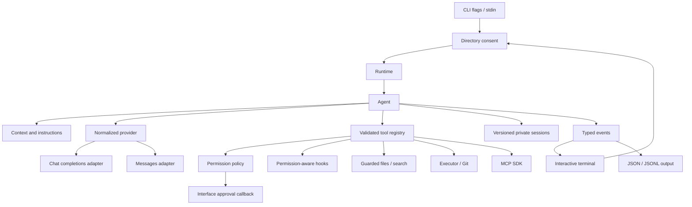

# Architecture

Airforce is a Node 24+ ESM TypeScript package published as `airforce-code`, with stable `airforce` and `airforce-code` executable aliases. The public module exports the engine and key extension boundaries.

## Modules

| Area           | Responsibility                                                                       |
| -------------- | ------------------------------------------------------------------------------------ |
| `agent`        | Bounded multi-step loop, steering queue, runtime composition, typed events           |
| `providers`    | HTTP/SSE, normalized OpenAI and Anthropic streams, dynamic models, PNG media         |
| `tools`        | Registry, guarded text edits, lexical/regex search, argv executor, Git, hooks, media |
| `security`     | Directory consent, path guards, risk policy, redaction and terminal sanitization     |
| `sessions`     | Atomic versioned storage, lock, message repair, history and edit snapshots           |
| `context`      | Shallow project map, lazy ignore-aware file index, budget/compaction                 |
| `instructions` | Scoped provenance and precedence of recognized guidance files                        |
| `cli`          | Arguments, command registry, automation, startup and lifecycle                       |
| `ui`           | Setup, fuzzy picker, input loop, event renderer and slash handlers                   |
| `mcp`          | Approved stdio startup and external capability adaptation                            |
| `extensions`   | Optional web/GitHub/media/sandbox contracts                                          |

## Provider normalization

Internal messages carry role/content and structured tool requests/results. Both protocol adapters consume these same types. SSE parsing handles UTF-8 fragments, CRLF, multiple data lines and frame/response budgets. The adapters assemble tool calls until a valid completion marker; a disconnected or length-truncated completion cannot accidentally execute a partial mutation. Model discovery normalizes the API's top-level capability fields, context length, and cents-per-million pricing into protocol-neutral model metadata.

HTTP retries are bounded and occur only before streaming starts. Authentication errors are not retried. No raw HTTP body appears in an error message. Timeout/cancellation propagates via `AbortSignal`. Unknown model capabilities stay unknown; explicit false disables tools, and OpenAI supports non-streaming models. Anthropic non-streaming compatibility is not yet implemented.

The API base URL is explicit and centrally normalized, not an assumed production hostname. Credentials never come from repository config. The media adapter requests a base64 PNG; remote image fetching is outside the initial capability.

## Agent execution

Each user request:

1. Acquire its session lock and repair missing results from interrupted tool batches.
2. Persist the redacted user requirement.
3. Build context from a shallow map, Git startup status, scoped instructions, durable summary and current history.
4. Compact if necessary, then request a normalized completion.
5. Save the assistant message/tool batch before executing it.
6. Validate each tool input, evaluate permissions, run configured hooks, execute sequentially, then save its result.
7. Repeat until a text completion, cancellation, error or turn limit.

Sequential mutation is intentional. The core has a steering queue that incorporates new user instructions at the next model boundary. The initial terminal UI supports cancellation and follow-up prompts but does not yet accept live typed steering while a request is running.

Typed events drive both interfaces. The engine does not import terminal libraries. No hidden chain-of-thought event is emitted. Completion status means the loop returned; engineering success must still be evaluated from tool/verification results and the final response.

## Permissions and subprocesses

A tool declares its schema, description, action risk and execution handler. Policy precedes execution. Read is automatic; edit is mode-dependent; arbitrary executables are approved explicitly because the local executor provides no isolation. Exact argv allowlists are user-owned grants for automation and apply only to the command tool. Denies and question-first restrictions precede allowlists. Hooks never inherit another tool's approval.

`Executor` is injectable so containers, OS restrictions or remote execution can be added without changing the loop. `LocalExecutor` strips credential variables, disables shell interpolation, bounds output and deadlines, and terminates process groups. This does not prevent approved programs from reading the user's filesystem or network.

## Files and recovery

Paths resolve under a canonical project root; known credential and internal paths are protected. Text reads use regular-file checks, hard-link rejection and `O_NOFOLLOW` where available. Writes compare full-file SHA256, stage a same-directory temporary file, recheck content and rename. Exact patch matching avoids fuzzy edits over user work.

Before changing bytes the session receives a pending edit snapshot. After the change, that record becomes applied. A crash may leave pending state; its before/after/current values provide evidence for recovery. Undo restores only if current content matches the tracked result. The redo stack follows undo order; new edits invalidate redo. The tool layer is not a multi-file transaction system.

The session retains original transcripts, while compaction changes only what is selected for the next request. Requirements remain verbatim. Provider usage events accumulate input/output tokens and estimated USD cost across model changes. Searchable resume selection is scoped to the canonical project root and reads this durable metadata without loading conversation text into the picker. Version 1 defaults migrate newly added optional fields; future incompatible versions fail explicitly. Private atomic files and UUID task locks protect ordinary concurrent usage. A malicious process racing the filesystem is outside this implementation's isolation boundary.

## Repository and instruction selection

Startup only inspects root entries and recognized manifests. Full indexing is lazy and capped. File search excludes dependency/build directories and respects scoped `.gitignore` patterns. Text search uses bounded regular-file reads; regex execution is isolated in a worker to avoid blocking cancellation with catastrophic backtracking. Embeddings are not needed for this version.

Guidance retains source paths and priority. Deeper instructions apply only to their subtree; equal-depth precedence is AIRFORCE, AGENTS, CLAUDE. Root guidance is initially loaded and nested files are loaded after target files enter the accessed set. The system prompt explicitly scopes each guidance source, preserving runtime/user precedence. This guidance cannot alter application policy.

## Terminal UI

The UI stays separate from the engine and consumes typed events. Inquirer provides masked setup fields, consent choices, approvals, and live model search. A focused raw-terminal input controller keeps ordinary terminal scrollback while rendering a framed input and bounded, scrolling slash-command palette on `/`, fuzzy filtering it as the user types, supporting history and multiline input, and cleaning up raw mode on exit. While the agent runs, a separate raw-key listener maps Escape to the same abort signal used by providers and child processes. Agent events drive a single-line animated activity indicator; it suspends before stream output and permission prompts so concurrent rendering cannot corrupt them. The responsive wordmark, panels, and semantic colors use a small theme layer and retain text labels when color is disabled.

First-run completion lives in user configuration. Directory trust is a separate owner-only store of canonical roots; the consent decision occurs before runtime repository mapping. A headless `--prompt` is explicit one-run authorization, and `--trust-directory` provides an automation-friendly persistent grant. Tool permissions still govern every subsequent action.

Ink remains an option for future full-screen components. Live steering input during generation and collapsible cards remain release work; the current terminal renderer provides Markdown highlighting and the interactive status card includes context, usage and estimated cost.

References: [Inquirer prompts](https://github.com/SBoudrias/Inquirer.js), [Ink](https://github.com/vadimdemedes/ink), [MCP TypeScript client SDK](https://ts.sdk.modelcontextprotocol.io/client), [Node release policy](https://nodejs.org/en/about/previous-releases).

## Integration boundaries

The official MCP SDK handles stdio transport and protocol negotiation. Airforce controls when processes start and wraps each server tool in local schema validation, permission and redaction. Transport trust is explicit: application wrappers cannot sandbox the server itself. Global configuration is supported; per-project and HTTP MCP require a separate trust workflow.

Web, GitHub and sandbox interfaces are intentionally contracts only; no command pretends those integrations are connected. Hooks work for tool/write/command events. Native OAuth uses the provider's registered public client, PKCE and a fixed loopback callback; API-key authentication remains available. Telemetry and update polling are absent, so no background source/prompt reporting occurs.

Authentication replacement validates a candidate API key or OAuth token through model discovery before replacing the owner-only credential file. The interactive command then rebuilds the provider and runtime so the current session uses the new credential. Environment-provided API keys remain an explicit higher-precedence override and cannot be changed in a parent shell by the CLI.

Windows command shims use [cross-spawn](https://github.com/moxystudio/node-cross-spawn) for executable resolution and argument escaping; the command boundary additionally rejects Windows CR/LF arguments. Raw shell interpolation is not exposed. NPM releases require configured [trusted publishing](https://docs.npmjs.com/trusted-publishers/) and a compatible NPM CLI, not merely a workflow file.
